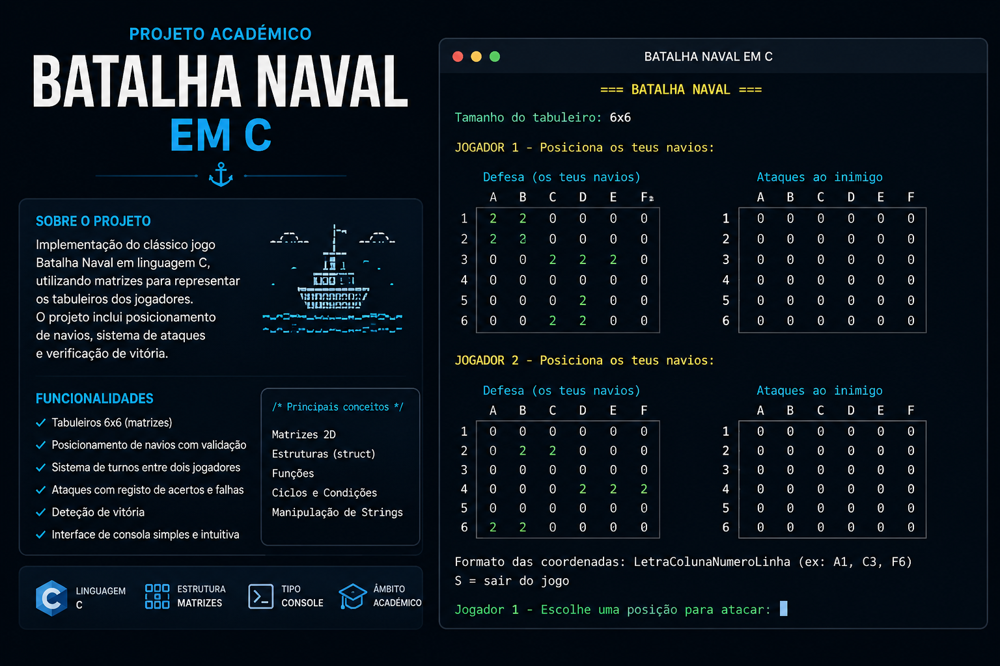
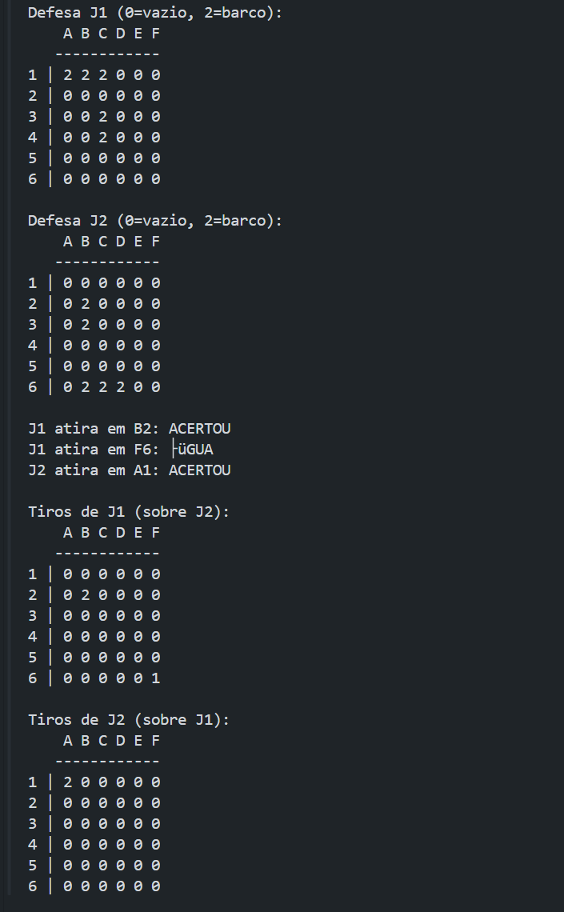

<p align="center">
  
</p>

# ⚓ Batalha Naval em C

Projeto académico desenvolvido no âmbito do **Curso Técnico de Programação — IEFP 2025/2026**, com o objetivo de consolidar fundamentos de programação em C através da implementação do clássico jogo **Batalha Naval** numa grelha `6x6`.

O projeto explora conceitos essenciais como **matrizes bidimensionais, estruturas (`struct`), funções, validação de coordenadas, controlo de estado, ciclos e condições**.

---

## 🎯 Objetivo do projeto

Construir uma versão funcional da Batalha Naval em ambiente de consola, permitindo representar os tabuleiros dos jogadores, posicionar embarcações, efetuar ataques e registar o estado das jogadas.

---

## 🧠 Conceitos aplicados

- Matrizes bidimensionais `6x6`
- Estruturas com `struct`
- Funções e modularização
- Ciclos `for`
- Estruturas condicionais
- Validação de coordenadas
- Manipulação de strings e caracteres
- Controlo de estado dos navios
- Registo de tiros, acertos e água
- Verificação de embarcações atingidas ou afundadas

---

## 🎮 Funcionamento

O jogo utiliza matrizes distintas para representar a **defesa** e os **tiros** de cada jogador.

### Matriz de defesa

| Valor | Significado |
|------:|-------------|
| `0` | Água / posição vazia 🌊 |
| `2` | Embarcação 🚢 |

### Matriz de tiros

| Valor | Significado |
|------:|-------------|
| `0` | Posição ainda não atacada |
| `1` | Água |
| `2` | Acerto |

As coordenadas são introduzidas no formato `A1` a `F6`, aproximando a interação de um tabuleiro tradicional de Batalha Naval.

---

## 🚢 Posicionamento das embarcações

Antes de uma embarcação ser posicionada, o programa verifica se:

- cabe dentro dos limites da grelha;
- não se sobrepõe a outra embarcação;
- respeita, quando ativada, uma zona de segurança entre navios;
- pode ser posicionada horizontal ou verticalmente.

Cada embarcação é representada pela estrutura `Ship`, que mantém informação sobre:

- tamanho;
- posições ocupadas;
- número de impactos;
- estado de colocação.

---

## 💥 Sistema de ataques

Quando é efetuado um disparo, o programa verifica a posição escolhida e atualiza a matriz de tiros.

- **Água** → o disparo é registado sem impacto;
- **Acerto** → a posição atingida é marcada;
- **Posição já atacada** → a jogada não é contabilizada novamente.

O estado das embarcações é atualizado à medida que os seus segmentos são atingidos.

---

## 🛠️ Tecnologias e ferramentas

- **Linguagem:** C
- **Compilador:** GCC
- **Interface:** Consola / Terminal
- **Paradigma:** Programação estruturada
- **Editor:** Visual Studio Code
- **Controlo de versão:** Git e GitHub

---

## ▶️ Como executar

### 1. Compilar

```bash
gcc batalha_matriz.c -o batalha_matriz.exe
```

### 2. Executar

No Windows através do Git Bash:

```bash
./batalha_matriz.exe
```

---

## 🖥️ Exemplo de execução

```text
Defesa J1 (0=vazio, 2=barco):

    A B C D E F
   ------------
1 | 2 2 2 0 0 0
2 | 0 0 0 0 0 0
3 | 0 0 2 0 0 0
4 | 0 0 2 0 0 0
5 | 0 0 0 0 0 0
6 | 0 0 0 0 0 0

J1 atira em B2: ACERTOU
```

---

## 📸 Demonstração do projeto

### Apresentação

<p align="center">
  
</p>

### Jogo em execução

> Nesta secção será adicionada uma captura real da execução do jogo no terminal.

<p align="center">
  
</p>

---

## 📚 Contexto académico

Este repositório foi criado para fins de **aprendizagem e prática em sala de aula**, no contexto da formação em Programação C do **Curso Técnico de Programação — IEFP 2025/2026**.

O projeto demonstra a aplicação prática de fundamentos da linguagem C através de um exercício clássico de lógica, estruturas de dados e manipulação de matrizes.

---

## 👩🏽‍💻 Autora

**Palmira Solochi**

Projeto académico desenvolvido no âmbito das aulas de **Programação C — IEFP 2025/2026**.